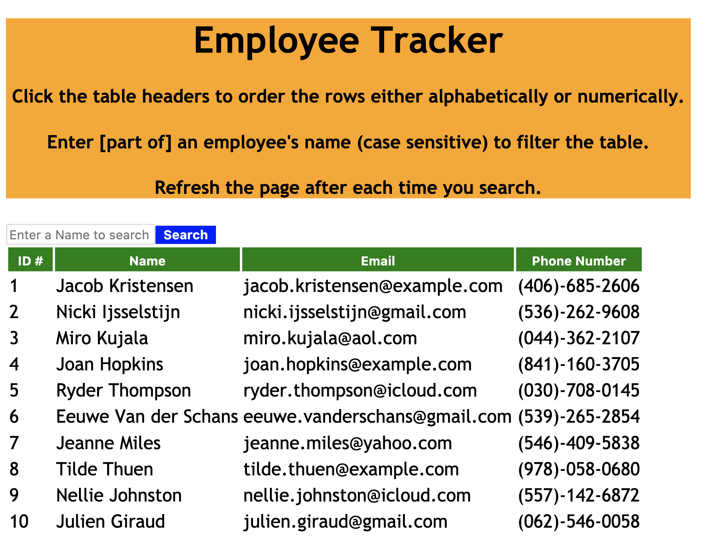
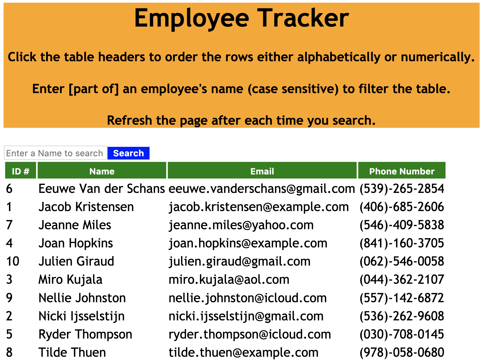
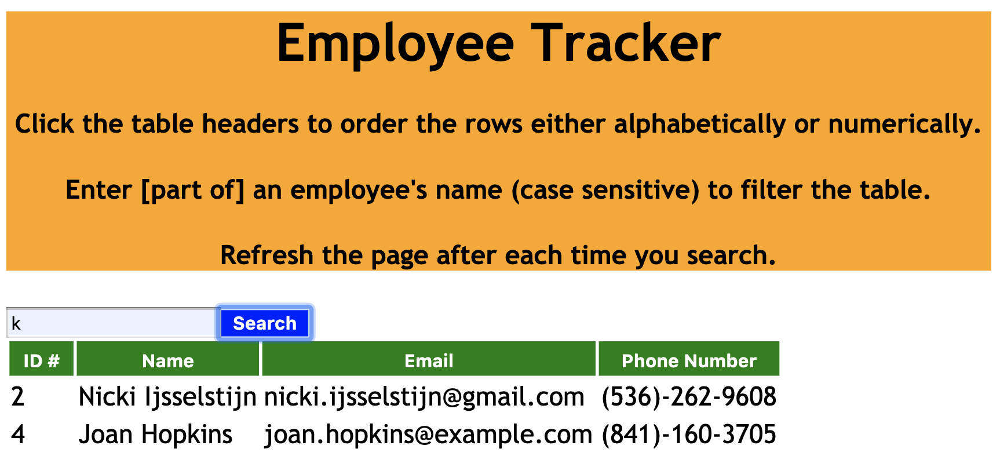

# HW19-User-Directory
My submission for the HW19-User-Directory assignment.

1) Description: This is an employee directory powered by React.  It allows the user to view all of their employees at once so they have instant access to the employees' information.  It also allows the user to sort the table by at least one category and filter the employees by at least one property.

2) Link to deployed application: https://github.com/bkim377/HW19-User-Directory

3) Screenshots: 

**At the start:** 
**Clicking a table header:** 
**Searching part of a name:** 